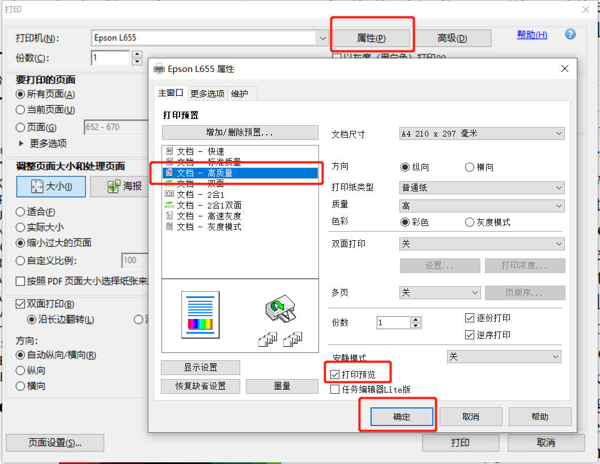


请扫描6611房间，空调开关上的二维码


## 1.1 Wi-Fi

| 房间 | 电话 | Wi-Fi |
|--|--|--|
| 6611 | 6488-1022 | `Yulab` (密码 yy123456789) |
| 6619 | 6488-1043 | `Yulab` (密码 yy123456789) |
| 6643 | 6488-7252 | `Yulab` (密码 yy123456789) |

<!--


  
  Yulab  [ 密码: yy123456789 ]        
  
 

  
  Yulab [ 密码: yy123456789 ]
  
 
 
  
  Yulab-43 [ 密码: yuyanglab ]  
  
  


## 1.2 Phone



  
  (010) 6488-1022
  

  
  (010) 6488-1041
  

  
  (010) 6488-7252
  
  


--> 

## 1.2 打印机


课题组内可用打印机位于6611和6643两个房间        


> 百度搜索 `添加网络打印机`，例如 [添加网络打印机的方法](https://jingyan.baidu.com/article/3c343ff7af3f460d377963a8.html)    

此处可下载[驱动程序](http://192.168.206.171/yulab_cloud/index.php/s/3d8NLQHEpwLNgTc)，默认安装。

| 房间 | 颜色 | 型号 | IP地址  |
|--|--|--|--|
| 6619 | 黑白 | Brother HL5590DN | 192.168.206.**133** |
| 6611 | 黑白 | HP LaserJet Pro MFP M226dw | 192.168.206.**173** |
| 6611 | 彩色 | Epson L655 | 192.168.206.**172** |

彩色打印，选择 `高质量文档`，可以获得更清晰的图表：

<figure>
  
</figure>

<!--

  
  192.168.206.173 >>>  HP LaserJet Pro MFP M226dw (黑白)   
  

  
  192.168.206.172 >>>  Epson L655 （彩色喷墨）    
  

  
  192.168.206.133 >>> Brother HL5590DN      
  


-->


ftp: ftp://159.226.118.232/upload/
username: ibpyu01
password: {询问}



