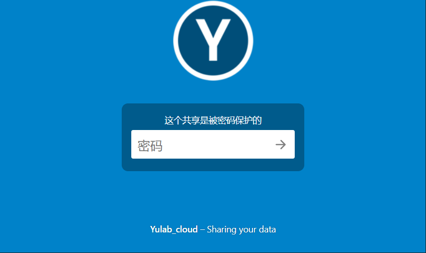
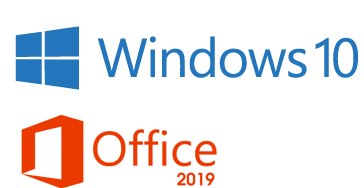
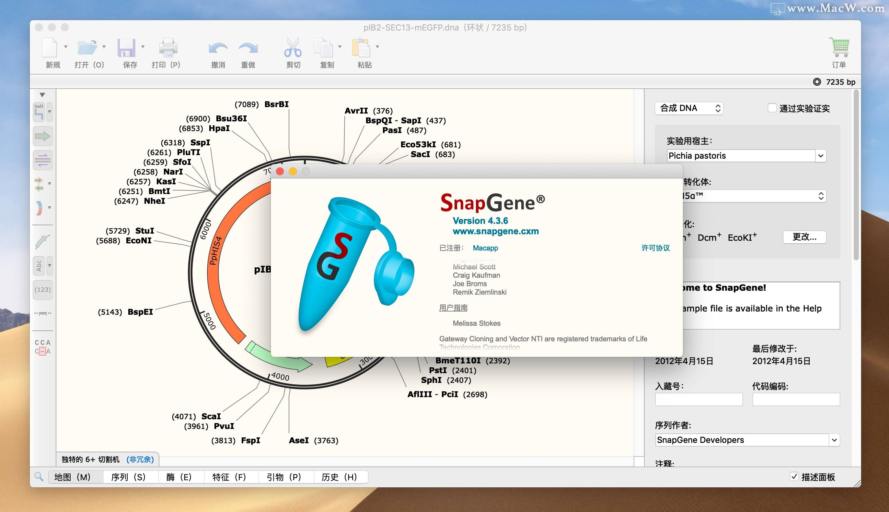
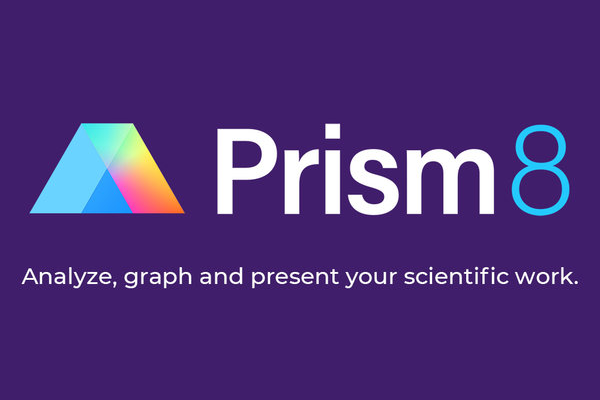
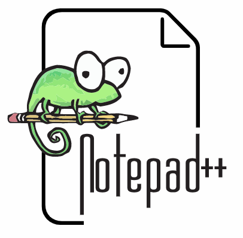

## 2.1 本地下载

> 此处软件大多来自互联网，有可能涉及侵权使用，请勿传播，并于下载后及时删除。

<p><a href="http://192.168.206.171/yulab_cloud/index.php/s/ezQEw7dgS8aKFS3">
  
</a></p>

+ `Yulab Cloud` [本地下载](http://192.168.206.171/yulab_cloud/index.php/s/ezQEw7dgS8aKFS3)

+ 请使用 [电脑管家](https://guanjia.qq.com/) 管理软件：[https://guanjia.qq.com/](https://guanjia.qq.com/)

<p><a href="https://guanjia.qq.com/">
  
</a></p>


## 2.2 正版软件 


正版软件是研究所统一购买，按次付费，课题组已统一付款，仅供**课题组内**电脑使用，请大家**保管好账号密码**，不外传。 



<p><a href="http://192.168.50.9">
  
</a></p>

可下载软件： `Office 2019`, `Windows 10`

网址：[http://192.168.50.9](http://192.168.50.9/)    

**在实验室微信群里询问，账号、密码**  


## 2.3 其他软件


以下软件多来自互联网，如涉及侵权，请务必于下载后24小时内自行删除，不可外传


### 2.2.1 SnapGene

<figure>
  
</figure>


`SnapGene`是一款强大的分子生物学软件，使您能够记录DNA构建体，而无需处理复杂的工具或工作流程。然后可以将数据导出为与设计用于DNA序列的其他流行软件解决方案兼容的文件格式。


请查看官方网站：[https://www.snapgene.com/](https://www.snapgene.com/),下载正版软件，可以申请两周 **Free Trial**，另外，如果不需要使用编辑功能，可以免费试用官方正版的 [SnapGene Viewer](https://www.snapgene.com/snapgene-viewer/)。

**使用方法**： 

```
（电脑上已经安装过SnapGene，请从步骤1开始；）
（没有装过SnapGene，直接从步骤3开始）

1. 运行 geek.exe

2. 选择SnapGene, "操作" -> "卸载"，按提示操作

3. 运行snapgene_4.1.9_win_2.exe安装；

4. 复制Crack文件夹中的ActivationCrack.exe到snapgene的安装文件夹内，右键以管理员运行，点patch；

5. 复制Crack文件夹中的Snapgene.exe到snapgene的安装文件夹内，覆盖原文件；

6. enjoy。
```


SnapGene 4.1.9 [下载地址](http://192.168.206.171/yulab_cloud/index.php/s/3JwzKrF3ZRTmbgL)  


### 2.3.2 画图软件 - Graphpad Prism       


<figure>
  
</figure>


`Graphpad Prism`是由Graphpad公司推出的一款非常实用的医学绘图软件，集生物统计、曲线拟合和科技绘图于一体可用于Windows和Mac电脑，在生物学以及社会和物理科学界得到广泛使用。[官网链接](https://www.graphpad.com/scientific-software/prism/)

  - Graphpad prism 8 [下载地址](http://192.168.206.171/yulab_cloud/index.php/s/8F4gA6qCey5Mq9W)


### 2.3.3 图像处理 - Image studio    

Image studio [下载地址](http://192.168.206.171/yulab_cloud/index.php/s/r89dgBk5xZoWR9f)


### 2.3.4 Flowjo VX 

<figure>
  
</figure>

Flowjo VX [下载地址](http://192.168.206.171/yulab_cloud/index.php/s/Xm5EApD3FQipY5F)    


### 2.3.5 引物设计 Premier Primer 5.0  

Premier Primer 5.0 [下载地址](http://192.168.206.171/yulab_cloud/index.php/s/XZH8StiwbEJ9qqt)    


### 2.3.6 FTP下载工具 - Filezilla

<figure>
  
</figure>


`FileZilla` 客户端是一个快速可靠的、跨平台的FTP,FTPS和SFTP客户端。具有图形用户界面(GUI)和很多有用的特性。

[官网下载](https://filezilla-project.org/download.php?type=client)， [本站下载](http://192.168.206.171/yulab_cloud/index.php/s/RaLCaotDw2ZCb6T)


### 2.3.7 SSH客户端 - MobaXterm 

<figure>
  
</figure>

`MobaXterm`是一款非常强大的终端增强工具，除了支持基本`SSH`终端管理之外，还有非常多扩赞功能。    
Enhanced terminal for Windows with X11 server, tabbed SSH client, network tools and much more

[官网下载](https://mobaxterm.mobatek.net/download.html), [本站下载](http://192.168.206.171/yulab_cloud/index.php/s/ec246JjzkC4BkYm) MobaXterm v11.0 protable; 


### 2.3.8 文本编辑 - Notepad ++  

<figure>
  
</figure>

`Notepad ++`是一个用于编写文本的免费开源应用程序。`Notepad ++`是一个功能强大的编辑器，非常适合编程和普通文本。

[官网下载](https://notepad-plus-plus.org/download/v7.6.2.html), [本站下载](http://192.168.206.171/yulab_cloud/index.php/s/emYwHrEmNYGpNKE)


### 2.3.9 视频录制工具 - Captura

<figure>
  
</figure>

参考知乎回答：[有哪些值得推荐的电脑录屏软件与手机录屏软件？](https://www.zhihu.com/question/22371082) - by `霸都、傲天`

1. 通过 **录频工具** 录制视频，例如：开源工具  [Captura](https://mathewsachin.github.io/Captura/), [下载地址](https://github.com/MathewSachin/Captura/releases/download/v8.0.0/Captura-Setup.exe), 同时下载辅助工具 [FFmpeg](https://www.gyan.dev/ffmpeg/builds/ffmpeg-git-full.7z)

本站下载地址: [Capture](http://192.168.206.171/yulab_cloud/index.php/s/atFbCMC4yJPBLoz), [FFMpeg](http://192.168.206.171/yulab_cloud/index.php/s/8Dai58kPwekBWan)

2. 双击运行 `Captura-Setup.exe`，按照默认方式安装；

3. 解压缩`FFmpeg`;

4. 在 `Captura`界面，`Video Source`，选择第5个**Region**，将弹出的虚线框和视频播放界面对齐；

5. 在`Captura`界面，`Audio`，将麦克风图标点开，勾选Audio的全部选项；  

6. 在`Captura`界面，`Video Encoder`选择 `FPS: 9`, `Quality: 60%`

7. 在`Captura`界面，底部 `Output Folder`，选择一个 D盘的文件夹，例如：`D:\Videos`;  

8. 开始录制；先播放视频，再点击 "红色圆点"开始录制。

9. 首次录制时，会提示`FFmpeg`未找到，点击`Select FFmpeg folder`，找到**步骤3**的文件位置 `ffmpeg-2020-10-07-git-a086b73e1f-full_build\bin`，可以解决问题。


