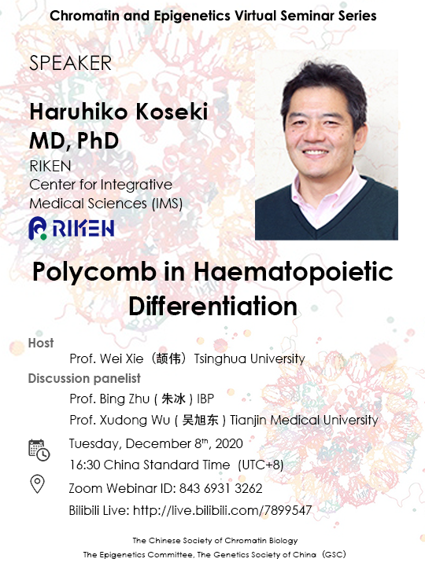

### Chromatin and Epigenetics Virtual Seminar Series

**Title**: Polycomb in Haematopoietic Differentiation      
**Speaker**: Haruhiko Koseki, RIKEN     
**Host**: Wei Xie (颉伟), Tsinghua University     
**Date**: 2020-12-08   
**Link**: [video](http://159.226.118.232/upload/img/2020_CSHL_videos/2020-seminar/Chromatin-and-Epigenetics-20201208-Haruhiko-Koseki-Polycomb-in-Haematopoietic-differentiation.mp4), (time: 1h16m)

