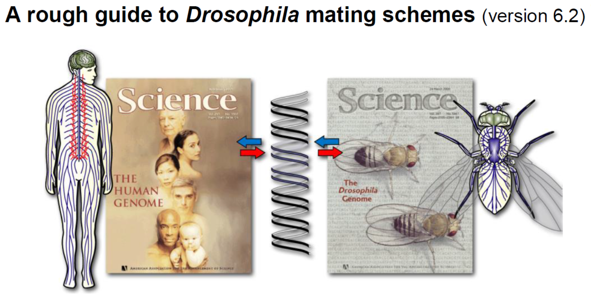

## Paper list

1.Kaufman, T. C. **A Short History and Description of Drosophila melanogaster Classical Genetics: Chromosome Aberrations, Forward Genetic Screens, and the Nature of Mutations**. Genetics 206, 665–689 (2017).  DOI: [10.1534/genetics.117.199950](https://doi.org/10.1534/genetics.117.199950), [pdf](http://192.168.206.171/yulab_cloud/index.php/s/JDmRxRejLiText8)  

2.Roote, J. & Prokop, A. **How to Design a Genetic Mating Scheme: A Basic Training Package for Drosophila Genetics**. G3 3, 353–358 (2013). DOI: [10.1534/g3.112.004820](https://doi.org/10.1534/g3.112.004820),  [pdf](http://192.168.206.171/yulab_cloud/index.php/s/LEAf3YEA2aMtqtF) 

3.Chyb, S. & Gompel, N. **Atlas of Drosophila morphology: wild-type and classical mutants**. (Academic Press, 2013). [pdf](http://192.168.206.171/yulab_cloud/index.php/s/dyeJNnfiHWE3Zwx)

4. **A rough guide to Drosophila mating schemes** (version 6.2, 2013) [pdf](http://192.168.206.171/yulab_cloud/index.php/s/yepA32KjLqMqoyY)  

## More details

#### 1. How to Design a Genetic Mating Scheme: A Basic Training Package for Drosophila Genetics (2013) [pdf](http://192.168.206.171/yulab_cloud/index.php/s/LEAf3YEA2aMtqtF)

Provide a training package for basic Drosophila genetics, designed to ensure that basic knowledge on all key areas is covered while reducing the time invested by trainers.

#### 2. A rough guide to Drosophila mating schemes (version 6.2) [pdf](http://192.168.206.171/yulab_cloud/index.php/s/yepA32KjLqMqoyY)  

#### 3. Atlas of Drosophila Morphology (2013) [pdf](http://192.168.206.171/yulab_cloud/index.php/s/dyeJNnfiHWE3Zwx)

[url](https://www.sciencedirect.com/book/9780123846884/atlas-of-drosophila-morphology)

