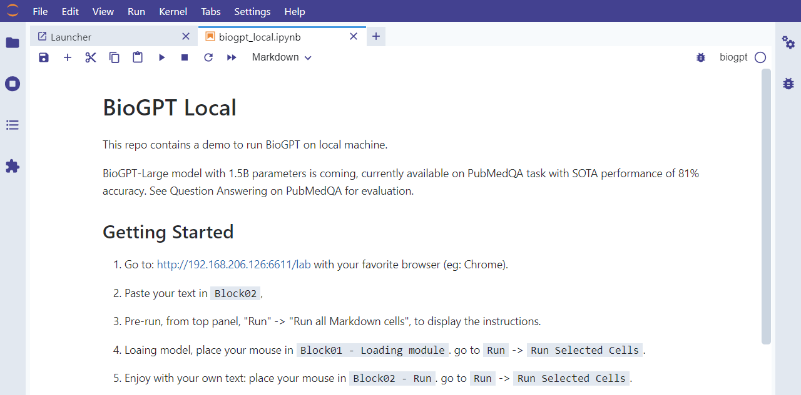

# BioGPT

Microsoft’s BioGPT, a generative pre-trained Transformer language model in a biomedical domain. It can be used for lifescience literature text generation and mining. 

Cite:

1. Luo, R. et al. BioGPT: generative pre-trained transformer for biomedical text generation and mining. Briefings in Bioinformatics 23, bbac409 (2022). doi: [10.1093/bib/bbac409](https://doi.org/10.1093/bib/bbac409) 

GitHub: [microsoft/BioGPT](https://github.com/microsoft/BioGPT)

Hugging Face: [microsoft/biogpt](https://huggingface.co/microsoft/biogpt?text=COVID-19+is+a+global+pandemic)

### Getting Started
1\. Go to: [http://192.168.206.126:6611/lab](http://192.168.206.126:6611/lab) with your favorite browser (eg: Chrome). 

2\. Show instructions. from top panel, `Run` -> `Run all Markdown cells`, to display the instructions.

3\. Load model. place your mouse in `Block01 - Loading module`. go to `Run` -> `Run Selected Cells`. (Watting for 1-2 mintues)

4\. Enjoy with your own text: place your mouse in `Block02 - Run`. go to `Run` -> `Run Selected Cells`.

\*\*Cite\*\*:  BioGPT: Generative Pre-trained Transformer for Biomedical Text Generation and Mining, by Renqian Luo, Liai Sun, Yingce Xia, Tao Qin, Sheng Zhang, Hoifung Poon and Tie-Yan Liu.

### 1. 访问本地BioGPT
浏览器访问：[http://192.168.206.126:6611/lab](http://192.168.206.126:6611/lab) 

输入密码：\[<ask>\]

### 2. 打开文件
进入如下jupyterlab，双击打开左侧文件：`biogpt_local.ipynb`

### 3. 显示操作步骤

`Run` -> `Run all Markdown cells`, to display the instructions.

### 4. 运行结果

`Run` -> `Run Selected Cells`.

