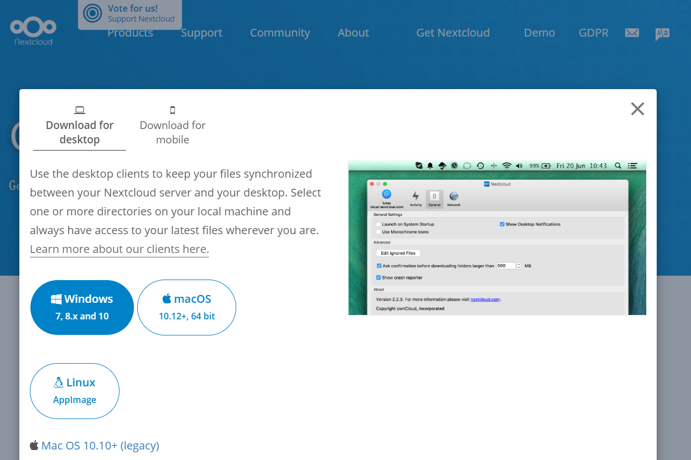

## 2.1 下载客户端

<figure>
  
</figure>

`Yulab Cloud`使用的客户端是 `NextCloud` ，其官网链接[Nextcloud](https://nextcloud.com/install/#install-clients)，软件下载地址如下：

+ Windows 10: [extcloud-3.0.0-setup.exe](https://download.nextcloud.com/desktop/releases/Windows/latest)

+ macOS: [Nextcloud-3.0.0.pkg](https://download.nextcloud.com/desktop/releases/Mac/Installer/latest)

## 2.2 安装

按照 **默认** 设置安装。

