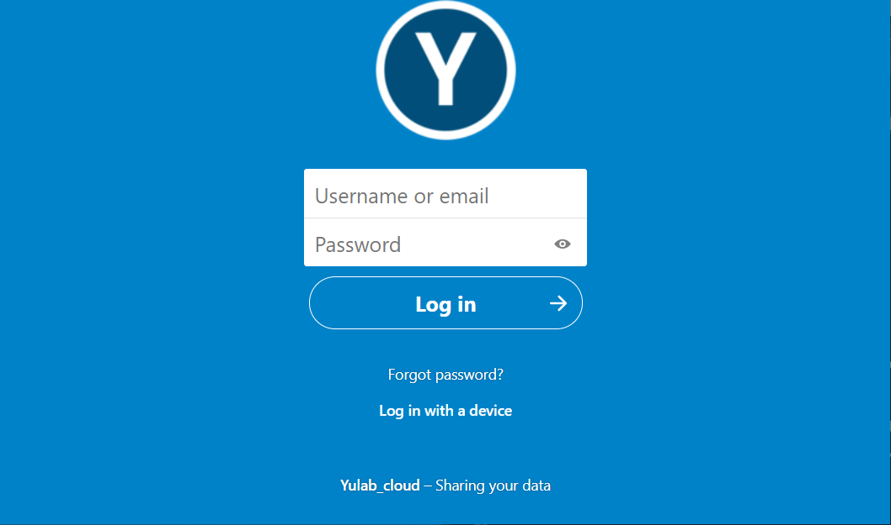

## 2.1 访问网站 

在网页浏览器 (例如：`Chrome`, `FireFox`)输入以下网址：

[http://192.168.206.171/yulab_cloud](http://192.168.206.171/yulab_cloud)，访问Yulab Cloud的网站。 (获取用户名和密码，参考前1条“1.申请账号”)

## 2.2 文件操作

如下图琐事，可以进行`上传` 和 `下载`，也可以进行`搜索`

<figure>
  
</figure>

